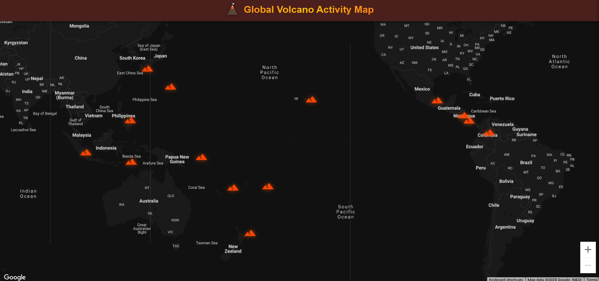

# Volcano Activity Explorer


<p align="center">
  
</p>

A React application that visualizes **active volcanic events worldwide**
using NASA's EONET API. The app features a custom dark map theme,
animated lava markers, a mobile-optimized slide-out info drawer, reverse
geocoding, and curated volcano facts --- all fully rebuilt from scratch
into a polished, portfolio-ready project.

------------------------------------------------------------------------

## 🌋 Features

### **Live Global Volcano Map**

-   Interactive map powered by NASA EONET (category: volcanoes)
-   Real coordinates, metadata, and live activity updates
-   Custom dark map style (`mapStyles/darkMap.js`)

### **Custom Lava-Themed Volcano Markers**

-   Animated SVG volcano markers
-   Glow effects tuned for dark maps
-   Optimized for performance

### **Mobile-First Volcano Info Drawer**

-   Tap or click markers to open a sliding drawer
-   Smooth mobile gestures
-   Displays volcano metadata, elevation, last eruption, country, and
    fun facts

### **Reverse Geocoding**

-   Uses OpenStreetMap Nominatim to convert coordinates → country names

### **Local Volcano Facts Database**

-   Curated facts including:
    -   Volcano type
    -   Elevation
    -   Last known eruption
    -   Unique historical/geological details
-   See `src/data/volcanofacts.js`

### **Custom Branding & UI**

-   `VolcanoHeader` with animated SVG artwork
-   Custom favicon set
-   Fully responsive layout (mobile/tablet/desktop)

------------------------------------------------------------------------

## 🚀 Getting Started

### Install Dependencies

``` text
npm install
```

### Start the Development Server

``` text
npm start
```

### Build for Production

``` text
npm run build
```

------------------------------------------------------------------------

## 🔑 API Keys

This project uses:

-   **NASA EONET API** --- No key required\
-   **OpenStreetMap Nominatim** --- No key required\
-   **Google Maps JavaScript API** --- *Required*\
    Set your key in `.env` as:\
    `REACT_APP_GOOGLE_MAPS_API_KEY=your_key_here`

------------------------------------------------------------------------

## 📁 Project Structure

``` text
src/
    components/
        DataLoader.js          # Fetches EONET volcano events and prepares data
        VolcanoHeader.js       # Custom UI header w/ animated volcano SVG
        VolcanoMap.js          # Main map component + marker rendering
        VolcanoInfoDrawer.js   # Slide-out volcano details panel
        VolcanoMarker.js       # Custom lava-glow SVG marker
    data/
        volcanofacts.js        # Curated volcano details database
    mapStyles/
        darkMap.js             # Custom dark map theme definition
    App.js                     # App layout and app-wide state
    index.css                  # Global styles
    index.js                   # Application entry point
```

------------------------------------------------------------------------

## 🧪 Technologies Used

-   **React 17**
-   **Google Map React** (interactive map)
-   **NASA EONET API**
-   **OpenStreetMap Nominatim**
-   **Iconify** (SVG icons)
-   **Custom SVG Artwork**
-   **CSS** (responsive layout + mobile drawer)
-   **Testing Library** (@testing-library/\*)
-   **Create React App** (react-scripts)

------------------------------------------------------------------------

## 📜 License

MIT License --- you are free to use, modify, and distribute this
project.

------------------------------------------------------------------------

## 🙌 Acknowledgments

-   NASA EONET for open volcanic activity data\
-   OpenStreetMap Nominatim for geocoding\
-   Google Maps Platform\
-   React community

------------------------------------------------------------------------
